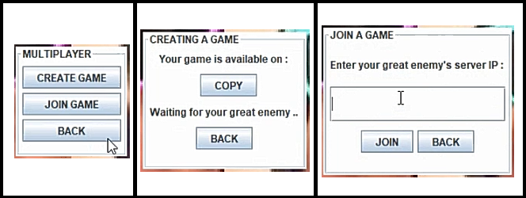
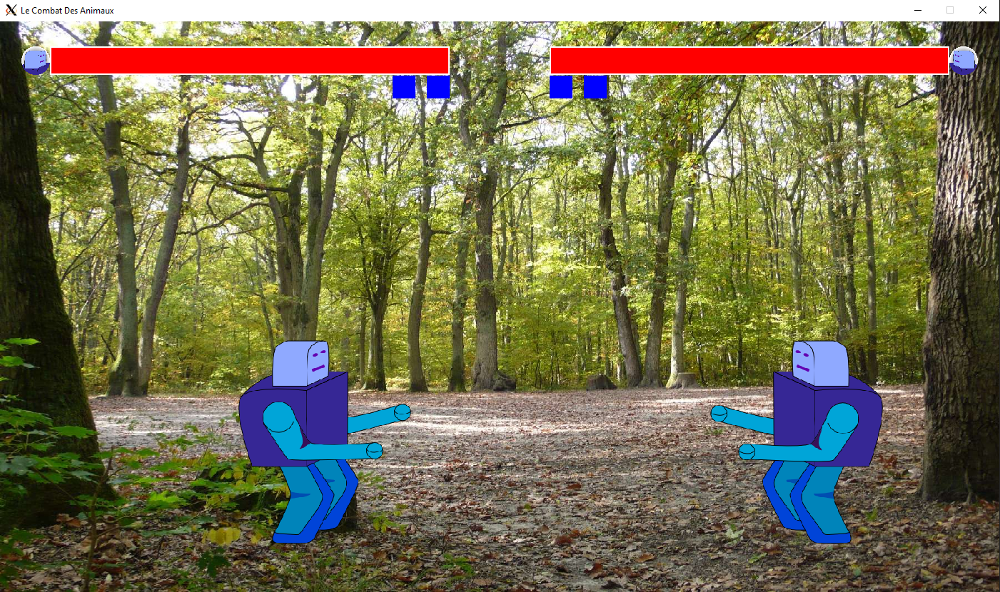
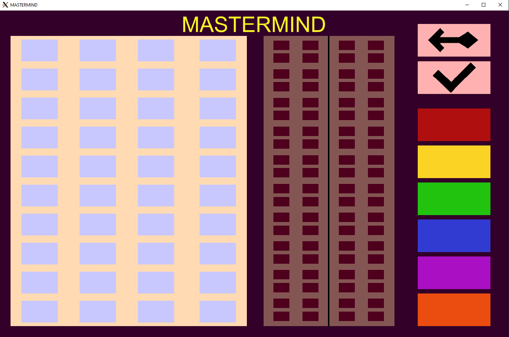

# Portfolio
My personnal developer portfolio

### About Me

### Glossary
\      | Games
:----: | :---:
Unity  | [Ghost of Damocles](#Ghost-of-Damocles)
C SDL2 | [Combat des animaux](#Combat-des-animaux) \| [Stickman Canon](#Stickman-Canon) \| [FloodIt And MasterMind](#FloodIt-And-MasterMind)
Java   | [Jump It Catch It](#Jump-It-Catch-It) \| [Snake](#snake)
Python | [GameJam PCPC](#GameJam-PCPC)

\      | Non Games
:----: | :---:
C++    | [Majhong Organizer](#Majhong-Organizer) \| [Moteur Physique](#Moteur-Physique)

- - - -
## Ghost of Damocles
`GameJam Project` `Unity` `2021`

Game made using Unity for the University of Quebec at Chicoutimi's game jam : WonderJam 2021 (48h)

You embody a young traveler greedy for gold and wealth but who is bound to a damned ghost. 
The only way to free yourself from this curse is to explore a castle full of horrible monsters in order to find how to break up the link between him and the ghost of damocles.

The theme imposed by the gamejam was: "The Connection" 
The styles imposed by the gamejam were : Platformer - Horror - Management

My part in the project : 
Code Enemies, Platforms and Camera Movements 
Draw some assets / animations

Code : 
[Source Code Here](https://github.com/CavaniNicolas/WonderJam2021) 
[Itch.io Page](https://mozri.itch.io/ghost-of-damocles)

Video : 
[SpeedRun Youtube Video (2m)](https://www.youtube.com/watch?v=okPEswnatQk&t=8s) 
[GamePlay Youtube Video (10m)](https://www.youtube.com/watch?v=MXoUfZ68IS0&t=12s) 
[Trailer Youtube Video (2m)](https://www.youtube.com/watch?v=GxllKxtvGx4&t=1s)

Screenshots : 
 
 

[Back To Top](#Portfolio)
- - - -

## Jump It Catch It
`Personnal Project` `Java` `2020`

Coded a 1V1 online game with a friend using Java. 60 hours project each, 2020

Fun Action Game. Two players fight each other to the death, catching items to boost their stats, shooting at each other or pushing themselves into the gap. The game can be played with the two players on the same keyboard or online. The keybindings are editable.

My part in the project : 
The whole game 
My friend did the menus and online part

Code : 
[Source Code Here](https://github.com/CavaniNicolas/JumpItCatchIt) 

Video : 
[Youtube Video Presentation (2m)](https://www.youtube.com/watch?v=7ZedQnzmgeo) 

Screenshots : 
 
 

[Back To Top](#Portfolio)
- - - -

## Physics Engine
`Work in progress` `C++` `OpenGL` `2021`

This project aims to simulate basic physics principles. Project as part of a UQAC course. 2021

My part in the project : 
Mostly OpenGL rendering part, project architecture and a little bit of the engine

Code : 
[Source Code Here](https://github.com/CavaniNicolas/MathsPhysiqueJV) 

Screenshots : 
 
 

[Back To Top](#Portfolio)
- - - -

## Combat des animaux
`Personnal Project` `C` `SDL2` `2019`

Redoing a street fighter game in C, 60 hours project, 2019 
This project uses SDL2 (more precisely SANDAL2, a SDL2 overlay). 
The whole interface is responsive to the window size, this does not add anything to the game but I had fun coding an optimized disposition of the characters in the menu (in other words : an auto filling menu). 
I also drew the character's animation myself, which is why its not good, but it was to have fun with spritesheets and SDL.

Code : 
[Source Code Here](https://github.com/CavaniNicolas/LeCombatDesAnimaux_GameJam) 

Video : 
[Youtube Video Presentation (2m)](https://www.youtube.com/watch?v=aMQEeo7yYOg) 

Screenshots : 
 

[Back To Top](#Portfolio)
- - - -

## Majhong Organizer
`Work in progress` `C++` `QML` `2021`

[Back To Top](#Portfolio)
- - - -

## Snake
`Personnal Project` `Java` `2020`

Small project to learn Java and Java Swing, 2020

Code : 
[Source Code Here](https://github.com/CavaniNicolas/Snake_Java) 

Video : 
[Youtube Video Presentation (2m)](https://www.youtube.com/watch?v=62bP-GzYvqA&t=1s) 

Screenshots : 
 

[Back To Top](#Portfolio)
- - - -

## GameJam PCPC
`GameJam Projects` `Python` `2019`

[Back To Top](#Portfolio)
- - - -

## Stickman Canon
`GameJam Projects` `C` `SDL2` `2019`

My first ever GameJam, C SDL2 (more precisely SANDAL2, a SDL2 overlay). 
A brick breaker game with colored stickman

Video : 
[Youtube Video Presentation (2m)](https://www.youtube.com/watch?v=mrCva9fO55w&t=2s) 

Screenshots : 
 

[Back To Top](#Portfolio)
- - - -

## FloodIt And MasterMind
`ISIMA Projects` `C` `SDL2` `2019`

FloodIt And MasterMind Games in C, SDL2 made as part of an ISIMA course.

Code : 
[Source Code Here](https://github.com/CavaniNicolas/CZZ1_TPs/tree/master/C1_TP6) 

Screenshots : 
 

[Back To Top](#Portfolio)
- - - -
